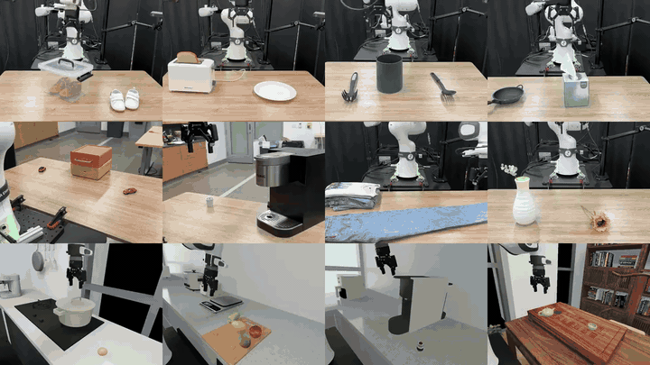

# Proxy Policy Steering

**[Project page](https://ppsteering.github.io/)** ·
**[Assets](https://huggingface.co/datasets/Tritiumac/PPS_assets)** ·
**[Checkpoints](https://huggingface.co/Tritiumac/PPS_checkpoints)**



## How it works

Steering needs three policies: a frozen **base** policy (pi0 / pi0.5) and two
small proxies — a **task** proxy trained on task demonstrations, and a
**reference** proxy distilled from the base policy. Inside the base policy's
flow-matching denoise loop, the two proxies' velocities are differenced and
added to the base velocity over the leading action dimensions:

```
v_t[:, :, :proxy_action_dim] += steer_scale * (task_v_t - ref_v_t)
```

The reference proxy cancels out whatever the task proxy inherited from the base
policy, so the difference carries only the task-specific correction.
`--steer_scale` sets the strength (0.4–0.8 is typical); `--only_steer` discards
the base velocity and uses the task proxy alone.

## Repository layout

```
eval_steering.py       steered rollouts (base + task proxy + reference proxy)
eval_pi.py             plain pi0 / pi0.5 rollouts, with OOD options
run_eval_chain.sh      run several tasks back to back
task_prompts.json      task ids, prompts and checkpoint paths (single source of truth)

openpi/                policy + training code (fork of Physical Intelligence's openpi)
  src/openpi/models/   pi0, pi05, pi0_fast, gemma, and the PROXY models
  src/openpi/training/config.py   config registry -- get_config("<name>")
  scripts/             train_pytorch.py, distill_pytorch.py, serve_policy.py, ...
  fetch_checkpoints.py download the released proxy checkpoints
  checkpoints/         (not committed) base policy + proxies live here

IsaacLab/              bundled IsaacLab, code only
  source/isaaclab_tasks/.../manipulation/{pot,tea,weight,capsule,...}/
  fetch_assets.py      download the scene / object assets
  assets/              (not committed) scene + object USDs live here

droid/                 real-robot stack
media/teaser.mp4       the clip above
```

## Setup

### 1. Environment

Evaluation launches an Isaac Sim app, so it needs **NVIDIA Isaac Sim + IsaacLab
dependencies and a GPU**. The bundled `IsaacLab/` is imported from inside the
repo, so no external IsaacLab checkout is required.

```bash
pip install huggingface_hub    # for the download helpers below
```

### 2. Assets and checkpoints

Neither is committed. Fetch both from the repo root:

```bash
python IsaacLab/fetch_assets.py        # 2.7 GB -> IsaacLab/assets/
python openpi/fetch_checkpoints.py     # 0.8 GB -> openpi/checkpoints/
```

| What | Hugging Face repo |
|---|---|
| Scene / object assets | [`Tritiumac/PPS_assets`](https://huggingface.co/datasets/Tritiumac/PPS_assets) |
| Proxy checkpoints (pot, tea, weight) | [`Tritiumac/PPS_checkpoints`](https://huggingface.co/Tritiumac/PPS_checkpoints) |

Fetch a subset with `--task`:

```bash
python openpi/fetch_checkpoints.py --task pot weight
```

> [!IMPORTANT]
> Checkpoints must live under a directory literally named `checkpoints`.
> `eval_steering.py` derives the training-config name from the path: it finds
> the `checkpoints` segment and reads the **next** one as the config name.
> Unpacking elsewhere fails with `Could not derive a training config name`.
> `fetch_checkpoints.py` refuses a `--local_dir` that breaks this.

Resulting layout:

```
openpi/checkpoints/
├── pytorch/pi05_droid_jointpos/                    # base policy -- supply yourself
├── proxy_isaaclab_droid_pot_pi05_jointpos/
│   ├── reference/20000/                            # reference proxy
│   └── task/24000/                                 # task proxy
├── proxy_isaaclab_droid_tea_pi05_jointpos/{reference/20000, task/32000}/
└── proxy_isaaclab_droid_weight_pi05_jointpos/{reference/20000, task/24000}/

IsaacLab/assets/
├── ArtVIP/Interactive_scene/{kitchen,diningroom,childrenroom,...}/
├── tianji/  objs/  cup/  mug/  egg/  knife/  ...
└── table.usd  table_move.usd
```

Each proxy directory holds `model.safetensors`, `metadata.pt` and
`assets/<dataset>/norm_stats.json`. Optimizer state is not published, so the
released checkpoints are for inference and steering, not for resuming training.

### 3. Base policy

The base policy is **not** part of the downloads. Place a trained
`pi05_droid_jointpos` checkpoint at `openpi/checkpoints/pytorch/pi05_droid_jointpos`
before evaluating; `--base_checkpoint_dir` is required by `eval_steering.py`.

## Evaluation in simulation

### All released tasks

`run_eval_chain.sh` reads `task_prompts.json`, so task ids, prompts and
checkpoint paths are never duplicated:

```bash
./run_eval_chain.sh                 # pot, then tea, then weight
./run_eval_chain.sh pot weight      # a subset, in the given order
./run_eval_chain.sh --list          # show every task the JSON defines
```

Overrides: `STEER_SCALE` (default `0.4`), `BASE_CKPT`, `SEED_START`, `SEED_END`,
`PYTHON`, and `CONDA_ENV` to run through `conda run -n <env>`.

| Task | IsaacLab task id | Prompt | Task proxy |
|---|---|---|---|
| pot | `Isaac-Pot-Droid-Visuomotor-v0` | remove the lid of the pot and put egg in it | `task/24000` |
| tea | `Isaac-Tea-Droid-Visuomotor-v0` | pour the tea from the teapot into the cup | `task/32000` |
| weight | `Isaac-Weight-Droid-Visuomotor-v0` | put pear and apple on the scale | `task/24000` |

`task_prompts.json` also defines `capsule`, whose checkpoints are not part of
this release — train it yourself, or drop the entry.

### A single steered run

```bash
CFG=openpi/checkpoints/proxy_isaaclab_droid_pot_pi05_jointpos

python eval_steering.py \
  --task "Isaac-Pot-Droid-Visuomotor-v0" \
  --exp_name eval_pps \
  --base_checkpoint_dir openpi/checkpoints/pytorch/pi05_droid_jointpos \
  --task_checkpoint_dir "$CFG/task/24000" \
  --ref_checkpoint_dir  "$CFG/reference/20000" \
  --prompt "remove the lid of the pot and put egg in it" \
  --steer_scale 0.4 \
  --task_num_steps 1200
```

### Baseline, without steering

Use `eval_pi.py` for un-steered pi0 / pi0.5 rollouts. `--model_name` is a name
from the config registry, and `--checkpoint_dir` should be passed explicitly:

```bash
python eval_pi.py \
  --task "Isaac-Pot-Droid-Visuomotor-v0" \
  --model_name pi05_droid_jointpos \
  --checkpoint_dir openpi/checkpoints/pytorch/pi05_droid_jointpos \
  --prompt "remove the lid of the pot and put egg in it" \
  --name eval_pi05 --max_steps 1200
```

It can also perturb the scene out of distribution: pass `--ood_mode` to enable
perturbation, then pick what to vary with `--ood_mode_light`
(`light_intensity`, `light_color`, `light_texture`, `all`) and
`--ood_mode_camera` (`camera_position`, `camera_orientation`, `all`).

> [!NOTE]
> `eval_steering.py` loads all three policies unconditionally, so
> `--task_checkpoint_dir` and `--ref_checkpoint_dir` are **not** optional —
> it is not a route to an un-steered baseline. Use `eval_pi.py` for that.

Rollout videos land in `results/<task>/<exp_name>/<seed>_{success,fail}.mp4`
for `eval_steering.py`, and `results/<task>/<name>/` for `eval_pi.py`.

## Training

Both stages run from `openpi/`. `<train-config>` is the proxy training config
(e.g. `proxy_isaaclab_droid_pot_pi05_jointpos`); the dataset is defined by the
config and registered in `openpi/src/openpi/training/config.py`.

**Stage 1 — reference proxy**, distilled from the base policy on the fly:

```bash
cd openpi
uv run scripts/distill_pytorch.py <train-config> \
  --exp_name reference \
  --teacher_checkpoint_dir checkpoints/pytorch/pi05_droid_jointpos
# -> checkpoints/<train-config>/reference/20000
```

**Stage 2 — task proxy**, initialized from the Stage-1 reference:

```bash
uv run scripts/train_pytorch.py <train-config> \
  --exp_name task \
  --pytorch_weight_path checkpoints/<train-config>/reference/20000
# -> checkpoints/<train-config>/task/{8000,16000,24000}
```

## Evaluation in the real world

```bash
cd openpi
uv run scripts/serve_policy.py policy:checkpoint \
  --policy.config=pi05_droid --policy.dir=checkpoints/pi05_droid
```

The real-robot client lives in `droid/`.
